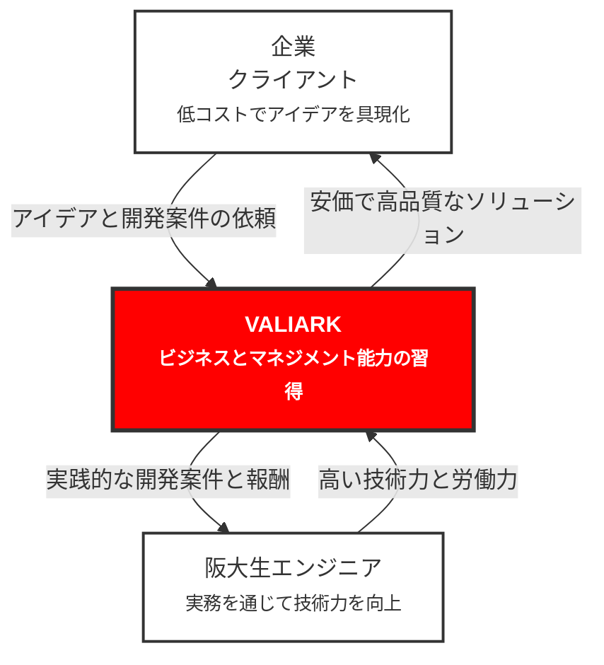

# VALIARK ビジネスモデル関係図

```mermaid
graph TD
    %% ノードの定義
    Client[企業<br/>クライアント<br/><small>低コストでアイデアを具現化</small>]
    Valiark[VALIARK<br/><small>ビジネスとマネジメント能力の習得</small>]
    Student[阪大生エンジニア<br/><small>実務を通じて技術力を向上</small>]
    
    %% 関係性の定義（矢印とテキスト）
    Client -->|アイデアと開発案件の依頼| Valiark
    Valiark -->|安価で高品質なソリューション| Client
    Valiark -->|実践的な開発案件と報酬| Student
    Student -->|高い技術力と労働力| Valiark
    
    %% スタイリング
    classDef valiarkStyle fill:#FF0000,stroke:#333333,stroke-width:3px,color:#FFFFFF,font-weight:bold
    classDef defaultStyle fill:#FFFFFF,stroke:#333333,stroke-width:2px,color:#333333
    
    %% クラスの適用
    class Valiark valiarkStyle
    class Client,Student defaultStyle
```
